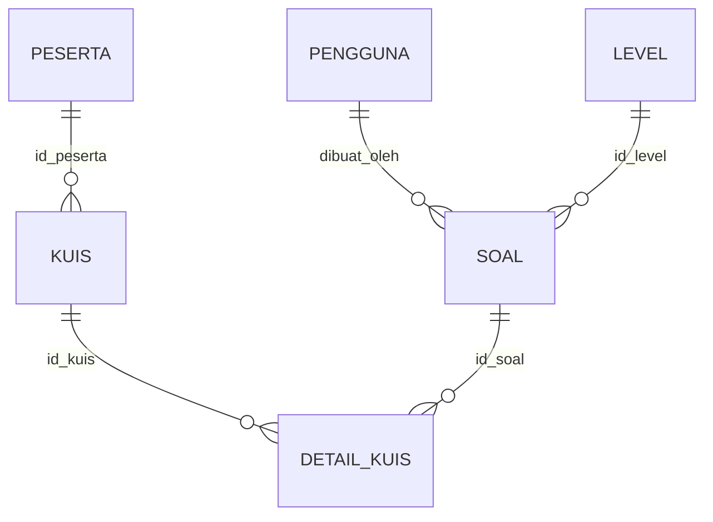
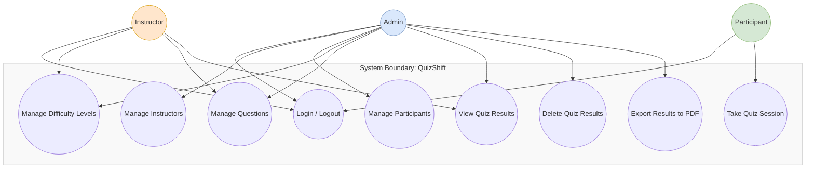
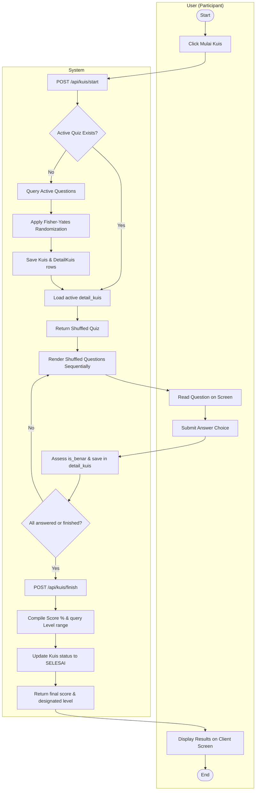
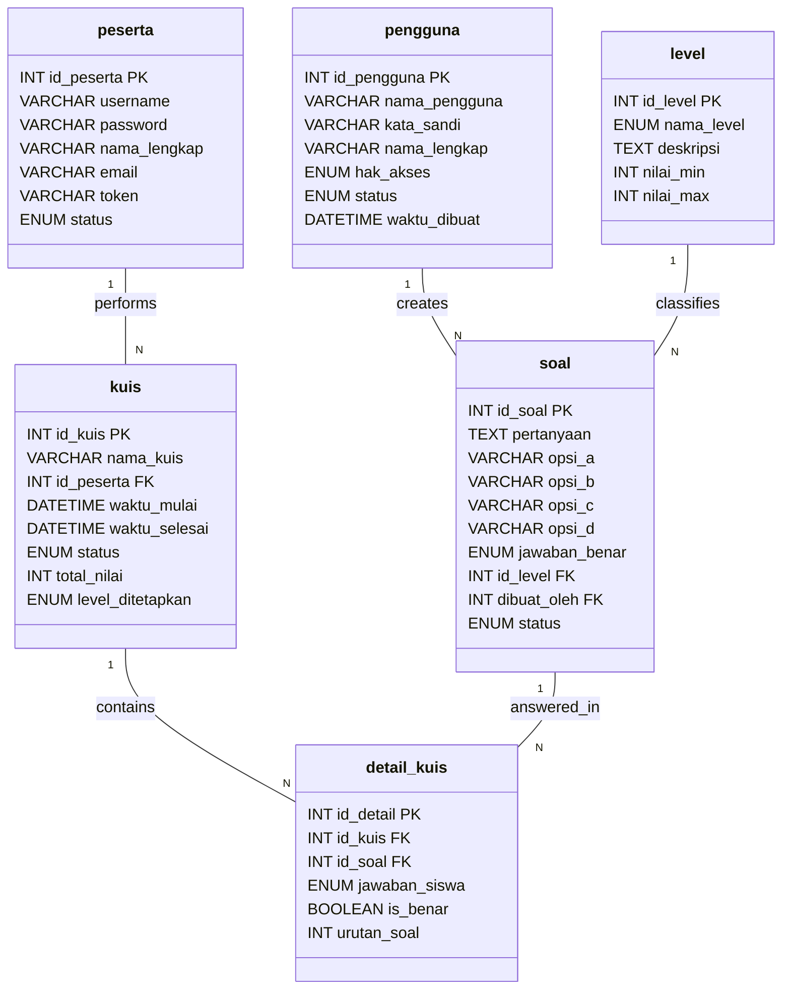
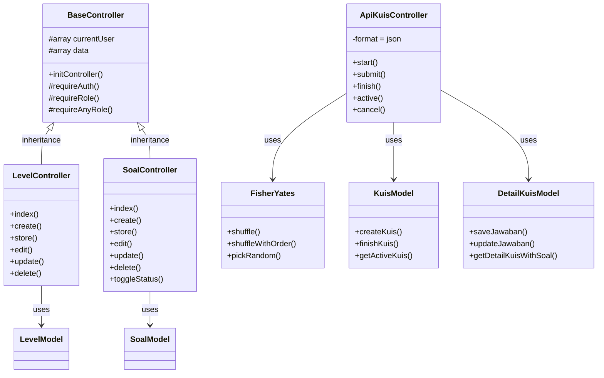

# QuizShift Project Documentation: Database, Core Flows & UML Diagrams

This document contains a comprehensive analysis and documentation of the database schema, business flows, and structural/behavioral UML diagrams of the **QuizShift** project (a CodeIgniter 4 English grammar leveling platform utilizing the Fisher-Yates shuffle algorithm).

---

## 📂 Generated UML Diagrams (.drawio)
Five highly detailed, grid-aligned, and beautifully styled `.drawio` files have been successfully generated and placed inside the [docs/](file:///Users/fikrikhairulshaleh/Valet/rian/quiz-shift-web/docs/) folder:
1. 📈 **Use Case Diagram**: [use_case.drawio](file:///Users/fikrikhairulshaleh/Valet/rian/quiz-shift-web/docs/use_case.drawio)
2. 🔄 **Activity Diagram**: [activity.drawio](file:///Users/fikrikhairulshaleh/Valet/rian/quiz-shift-web/docs/activity.drawio)
3. 🗂️ **Entity Relationship Diagram (ERD)**: [erd.drawio](file:///Users/fikrikhairulshaleh/Valet/rian/quiz-shift-web/docs/erd.drawio)
4. 🏗️ **Class Diagram**: [class.drawio](file:///Users/fikrikhairulshaleh/Valet/rian/quiz-shift-web/docs/class.drawio)
5. ⏳ **Sequence Diagram**: [sequence.drawio](file:///Users/fikrikhairulshaleh/Valet/rian/quiz-shift-web/docs/sequence.drawio)

> [!TIP]
> You can open these `.drawio` files directly in [Draw.io](https://app.diagrams.net/) (or the Draw.io desktop client/VS Code extension) by importing them. They are fully editable, color-coded, and vector-aligned.

---

## 🗄️ 1. Database Schema Analysis

The database consists of **6 tables** mapping out users, participants, proficiency levels, grammar questions, quiz sessions, and student answers.



### Table Details

#### A. Table `pengguna` (Administrative Users)
Stores administrators and instructors who manage the quiz contents.
* **`id_pengguna`** `INT(11) UNSIGNED AUTO_INCREMENT PRIMARY KEY` — Unique user identifier.
* **`nama_pengguna`** `VARCHAR(50) UNIQUE` — Username for login credentials.
* **`kata_sandi`** `VARCHAR(255)` — BCrypt-hashed password.
* **`nama_lengkap`** `VARCHAR(100)` — Full name.
* **`hak_akses`** `ENUM('ADMIN', 'INSTRUKTUR') DEFAULT 'INSTRUKTUR'` — Access level.
* **`foto_profil`** `VARCHAR(255) NULL` — Profile photo filename.
* **`status`** `ENUM('AKTIF', 'NONAKTIF') DEFAULT 'AKTIF'` — Active account status.
* **`waktu_dibuat`** `DATETIME` — Creation timestamp.
* **`waktu_diubah`** `DATETIME` — Modification timestamp.

#### B. Table `peserta` (Participants / Students)
Stores candidates taking the English proficiency test.
* **`id_peserta`** `INT(11) UNSIGNED AUTO_INCREMENT PRIMARY KEY` — Student identifier.
* **`username`** `VARCHAR(50) UNIQUE` — Username for logging into the test panel.
* **`password`** `VARCHAR(255)` — Password hash.
* **`nama_lengkap`** `VARCHAR(100)` — Full name.
* **`email`** `VARCHAR(100) UNIQUE` — Candidate email.
* **`no_hp`** `VARCHAR(20) NULL` — Handphone number.
* **`token`** `VARCHAR(255) UNIQUE` — Token key used for API-based quiz access.
* **`status`** `ENUM('AKTIF', 'NONAKTIF') DEFAULT 'AKTIF'` — Candidate status.
* **`waktu_dibuat`** `DATETIME` — Account creation timestamp.
* **`waktu_diubah`** `DATETIME NULL` — Account modification timestamp.

#### C. Table `level` (Proficiency Levels)
Difficulty classifications containing score thresholds.
* **`id_level`** `INT(11) UNSIGNED AUTO_INCREMENT PRIMARY KEY` — Level identifier.
* **`nama_level`** `ENUM('BEGINNER', 'INTERMEDIATE', 'ADVANCED')` — Level name.
* **`deskripsi`** `TEXT NULL` — Detailed description of criteria.
* **`nilai_min`** `INT(11) DEFAULT 0` — Minimum score boundary (e.g., `0` for Beginner, `60` for Intermediate, `80` for Advanced).
* **`nilai_max`** `INT(11) DEFAULT 100` — Maximum score boundary (e.g., `59` for Beginner, `79` for Intermediate, `100` for Advanced).
* **`waktu_dibuat`** `DATETIME` — Level creation timestamp.
* **`waktu_diubah`** `DATETIME NULL` — Level modification timestamp.

#### D. Table `soal` (Questions Bank)
The depository of grammar questions categorized by level.
* **`id_soal`** `INT(11) UNSIGNED AUTO_INCREMENT PRIMARY KEY` — Question identifier.
* **`pertanyaan`** `TEXT` — The grammar question text.
* **`opsi_a`**, **`opsi_b`**, **`opsi_c`**, **`opsi_d`** `VARCHAR(255)` — Multiple choice options.
* **`jawaban_benar`** `ENUM('A', 'B', 'C', 'D')` — The correct key.
* **`id_level`** `INT(11) UNSIGNED` — `FOREIGN KEY` references `level(id_level)` on cascade.
* **`dibuat_oleh`** `INT(11) UNSIGNED` — `FOREIGN KEY` references `pengguna(id_pengguna)` on cascade.
* **`status`** `ENUM('AKTIF', 'NONAKTIF') DEFAULT 'AKTIF'` — Status indicator.
* **`waktu_dibuat`** `DATETIME` — Creation timestamp.
* **`waktu_diubah`** `DATETIME NULL` — Modification timestamp.

#### E. Table `kuis` (Quiz Sessions)
Holds active and finished quiz sessions for students.
* **`id_kuis`** `INT(11) UNSIGNED AUTO_INCREMENT PRIMARY KEY` — Quiz session identifier.
* **`nama_kuis`** `VARCHAR(100)` — Automated quiz session name (e.g. `Kuis_2026-05-22_07-53-00`).
* **`id_peserta`** `INT(11) UNSIGNED` — `FOREIGN KEY` references `peserta(id_peserta)` on cascade.
* **`waktu_mulai`** `DATETIME NULL` — Starting timestamp.
* **`waktu_selesai`** `DATETIME NULL` — Finishing timestamp.
* **`status`** `ENUM('BERLANGSUNG', 'SELESAI', 'DIBATALKAN') DEFAULT 'BERLANGSUNG'` — Lifecycle state.
* **`total_nilai`** `INT(11) NULL` — Calculated final score percentage (0-100).
* **`level_ditetapkan`** `ENUM('BEGINNER', 'INTERMEDIATE', 'ADVANCED') NULL` — Evaluated English proficiency.
* **`waktu_dibuat`** `DATETIME` — Record creation timestamp.
* **`waktu_diubah`** `DATETIME NULL` — Record modification timestamp.

#### F. Table `detail_kuis` (Quiz Detailed Answers)
Maps selected questions to the quiz session, maintaining sequence and correctness.
* **`id_detail`** `INT(11) UNSIGNED AUTO_INCREMENT PRIMARY KEY` — Answer item identifier.
* **`id_kuis`** `INT(11) UNSIGNED` — `FOREIGN KEY` references `kuis(id_kuis)` on cascade.
* **`id_soal`** `INT(11) UNSIGNED` — `FOREIGN KEY` references `soal(id_soal)` on cascade.
* **`jawaban_siswa`** `ENUM('A', 'B', 'C', 'D') NULL` — Chosen option.
* **`is_benar`** `BOOLEAN DEFAULT FALSE` — Evaluated correctness flags (`0` for incorrect, `1` for correct).
* **`urutan_soal`** `INT(11) DEFAULT 0` — The randomized order index.
* **`waktu_dibuat`** `DATETIME` — Timestamp when generated/updated.

---

## 🔄 2. Core Functional Flows

### A. Quiz Startup & The Fisher-Yates Shuffle Algorithm Flow
When a candidate requests to start a quiz (`POST /api/kuis/start`):
1. **Resume Check**: The system searches for any record in `kuis` with status `'BERLANGSUNG'` for the candidate.
   - If found, it fetches the existing shuffled sequence from `detail_kuis` and resumes without re-shuffling.
2. **Retrieve Bank**: If none is active, it queries all active questions (`status = 'AKTIF'`) from `soal`.
3. **Random Permutation**: The questions array is randomized using the **Fisher-Yates Shuffle** algorithm:
   - For an array $A$ of size $N$, it counts backwards from $i = N - 1$ down to $1$.
   - Generates a random integer $j$ where $0 \le j \le i$.
   - Swaps elements at index $i$ and index $j$:
     $$\text{temp} = A[i];\quad A[i] = A[j];\quad A[j] = \text{temp};$$
4. **Sequence Assignment**: Adds a sequential value `urutan_soal` (from $1$ to $N$) to the shuffled items.
5. **Persistence**: Inserts a new `kuis` record, then inserts rows into `detail_kuis` linking the questions in their generated sequence.
6. **Stripping Response**: Converts the questions array to a clean JSON string, stripping the correct answers (`jawaban_benar`) for cheat prevention.

### B. Answer Submission Flow
When a student answers a question (`POST /api/kuis/submit`):
1. **Authentication**: Verifies the participant token.
2. **State Verification**: Asserts that `kuis.status` is `'BERLANGSUNG'`.
3. **Evaluation**: Queries the corresponding `soal.jawaban_benar`. Compares the submitted key against it:
   - If `jawaban_siswa === jawaban_benar`, `is_benar` is set to `1`.
   - Else, `is_benar` is set to `0`.
4. **Upsert Operation**:
   - If already answered, updates `jawaban_siswa` and `is_benar` in `detail_kuis`.
   - If new, inserts the answer record.

### C. Quiz Completion & Proficiency Leveling Flow
When a student finishes the quiz (`POST /api/kuis/finish`):
1. **Compile Answers**: Gathers all `detail_kuis` records associated with `id_kuis`.
2. **Calculate Corrects**: Counts total correct answers (`total_benar` where `is_benar = 1`).
3. **Calculate Percentage**:
   $$\text{Score} = \text{round}\left(\frac{\text{total\_benar}}{\text{total\_soal}} \times 100\right)$$
4. **Query Level Placement**: Queries `level` table:
   ```sql
   SELECT nama_level FROM level WHERE nilai_min <= :score AND nilai_max >= :score LIMIT 1;
   ```
5. **Update State**: Saves the results back into the `kuis` session, setting `total_nilai = Score`, `level_ditetapkan = nama_level`, and `status = 'SELESAI'`.
6. **Summary Response**: Delivers the score, correct/incorrect ratio, and determined grammar level back to the applicant.

---

## 🖼️ 3. UML Diagram Specifications

Below are the Mermaid.js markup specifications of all five UML diagrams representing the codebase architecture.

### A. Use Case Diagram
Visualizes the roles of Admin, Instructor, and Participant and their interactions.



### B. Activity Diagram
Shows the sequence of steps when a participant takes a test.



### C. Entity Relationship Diagram (ERD)
Defines physical tables, types, keys, and relational constraints.



### D. Class Diagram
Represents the structural code organization, inheritance, and dependencies.



### E. Sequence Diagram
Demonstrates the interaction sequence during the critical startup and evaluation lifecycle of a quiz.

```mermaid
sequenceDiagram
    autonumber
    actor Participant as Participant (Client)
    participant API as ApiKuisController
    participant FY as FisherYates Lib
    participant Models as Models (Kuis & Detail)
    participant DB as MySQL Database

    %% Quiz Startup
    Participant->>API: POST /api/kuis/start
    activate API
    API->>Models: getActiveKuis()
    Models->>DB: Query kuis status = 'BERLANGSUNG'
    DB-->>Models: Active kuis record (or NULL)
    
    alt No Active Session (New Quiz)
        API->>Models: getActiveSoal()
        Models->>DB: Query soal status = 'AKTIF'
        DB-->>Models: Active questions array
        API->>FY: shuffleWithOrder(questions)
        activate FY
        FY-->>API: Randomized questions + urutan_soal
        deactivate FY
        API->>Models: createKuis() & populate detail_kuis
        Models->>DB: INSERT INTO kuis & detail_kuis
        DB-->>Models: Insert status / IDs
    else Active Session Exists (Resume Quiz)
        API->>Models: getDetailKuisWithSoal()
        Models->>DB: Query detail_kuis JOIN soal
        DB-->>Models: Existing questions array sorted
    end
    
    API-->>Participant: 201 Created / 200 OK (Clean questions array)
    deactivate API

    %% Submit Answers Loop
    Participant->>API: POST /api/kuis/submit (id_soal, jawaban)
    activate API
    API->>Models: saveJawaban() / updateJawaban()
    Models->>DB: Compare correct key & save detail_kuis
    DB-->>Models: Saved status & is_benar
    API-->>Participant: 201/200 OK (Success, is_benar status)
    deactivate API

    %% Quiz Finish
    Participant->>API: POST /api/kuis/finish (id_kuis)
    activate API
    API->>Models: finishKuis(id_kuis)
    activate Models
    Models->>DB: Query detail_kuis answers where id_kuis
    DB-->>Models: Student answers array
    Note over Models: Computes score % (corrects / total * 100)
    Models->>DB: Query level range matching score
    DB-->>Models: designated level (e.g. INTERMEDIATE)
    Models->>DB: UPDATE kuis status='SELESAI', score, level
    DB-->>Models: Update success
    Models-->>API: Final statistics (score, level, ratios)
    deactivate Models
    API-->>Participant: 200 OK (Final score, statistics & designated level)
    deactivate API
```
