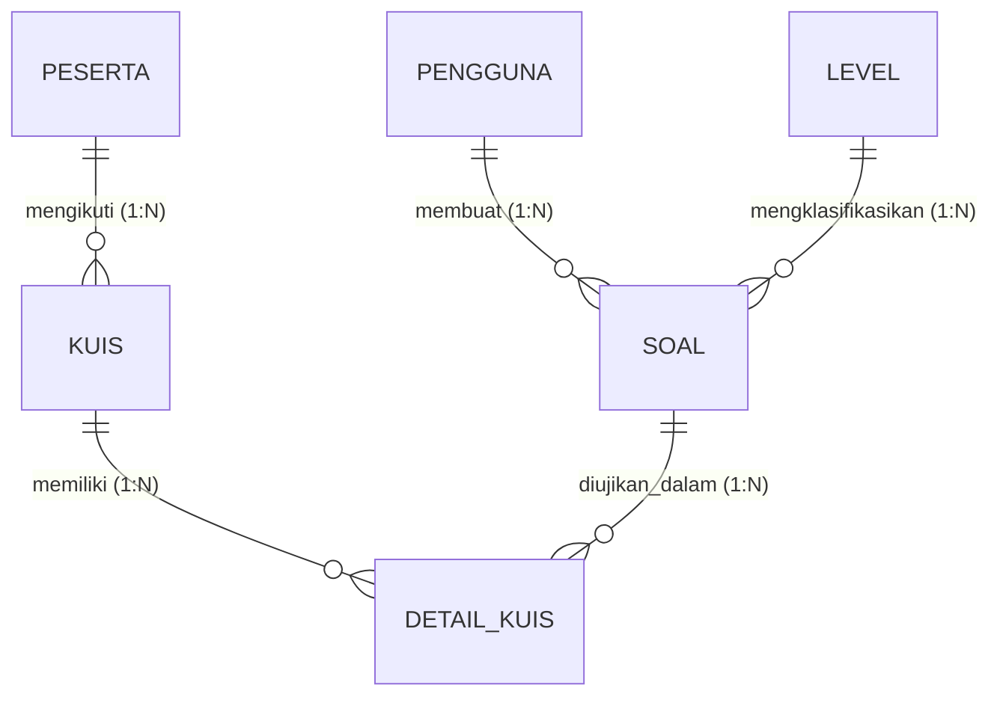
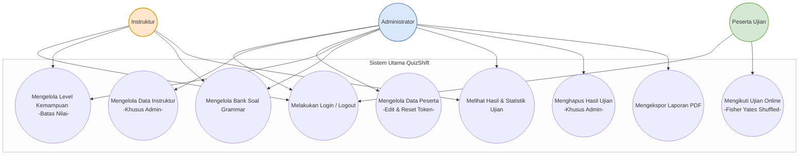
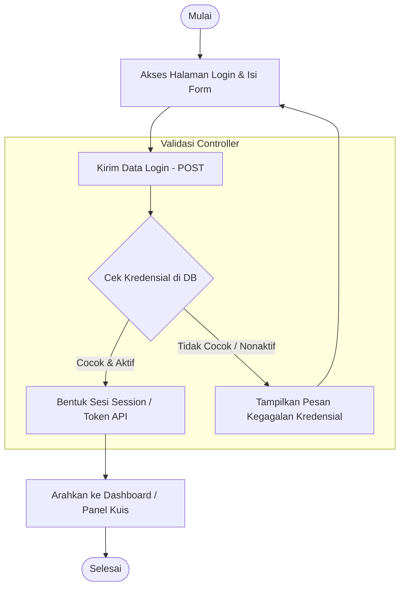
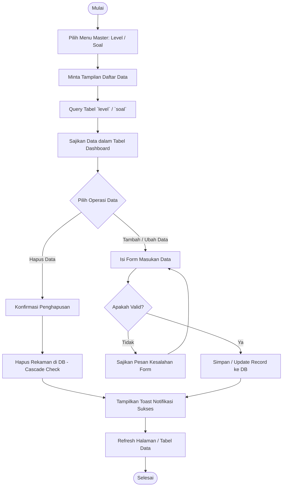
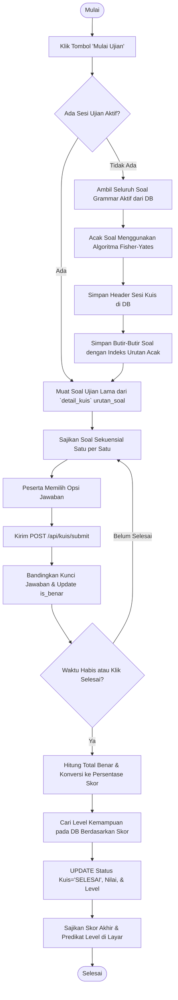
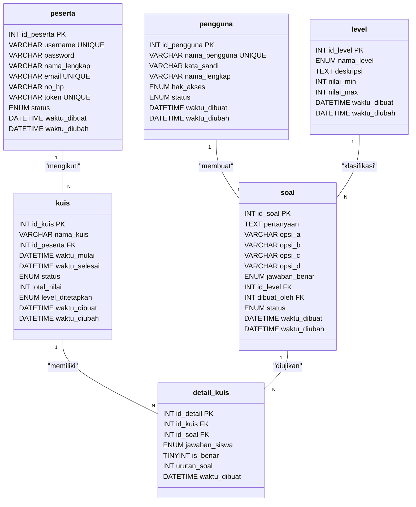
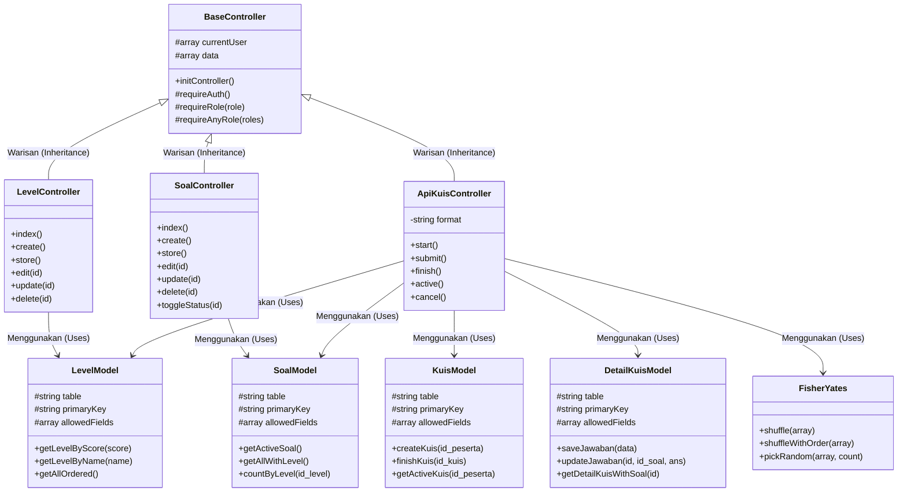
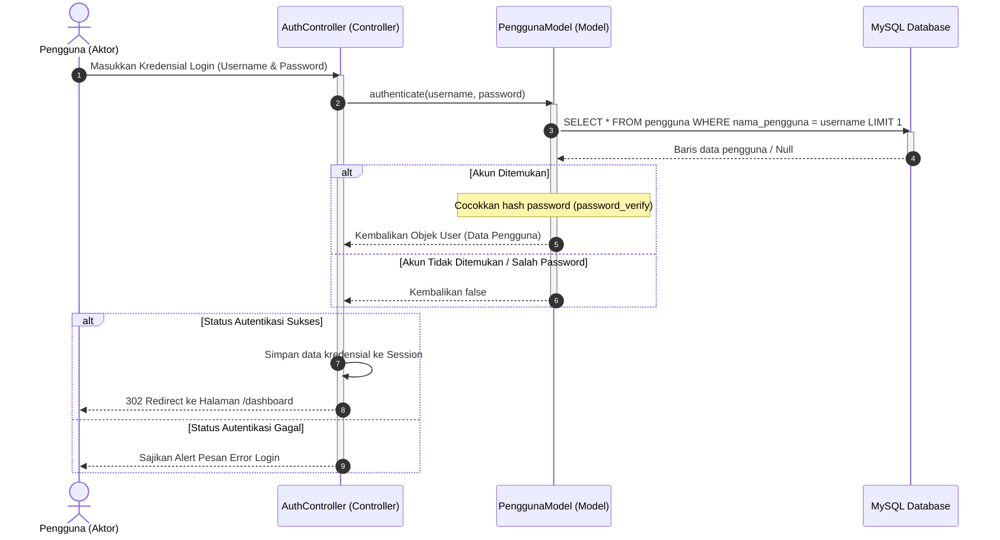
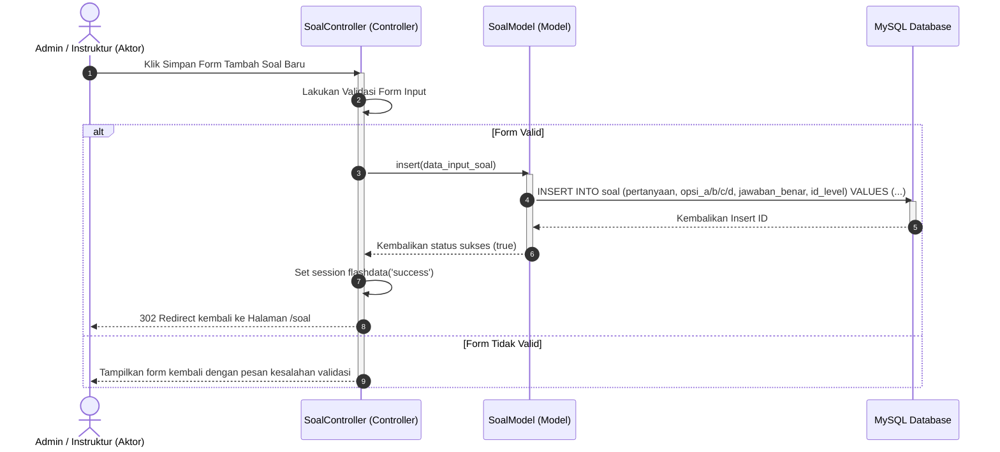
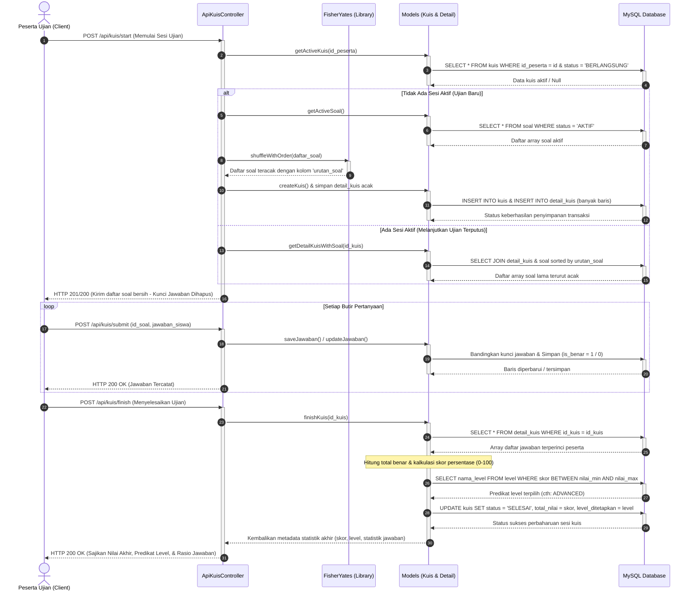

# DOKUMENTASI SISTEM, ALGORITMA, DAN DIAGRAM UML (STANDAR SKRIPSI S1)
## SISTEM EVALUASI KEMAMPUAN GRAMMAR BAHASA INGGRIS "QUIZSHIFT"
### BERBASIS FRAMEWORK CODEIGNITER 4 DENGAN ALGORITMA PENGACAKAN FISHER-YATES SHUFFLE

---

## 📂 1. Daftar File Diagram Draw.io Tergenerasi (.drawio)
Untuk mempermudah penulisan Bab 3 dan Bab 4 pada skripsi, telah dibuat **5 berkas diagram Draw.io (.drawio)** utama yang terstruktur rapi, menggunakan Bahasa Indonesia Baku, serta memiliki pewarnaan bertema premium (Mantis Theme). Beberapa diagram yang memiliki banyak alur/sub-proses digabungkan ke dalam **satu berkas dengan beberapa halaman/tab** agar sangat mudah dikelola. File-file ini tersimpan di dalam direktori `docs/` dan dapat diedit secara langsung menggunakan aplikasi [Draw.io](https://app.diagrams.net/):

1. **Use Case Diagram**: [use_case.drawio](file:///Users/fikrikhairulshaleh/Valet/rian/quiz-shift-web/docs/use_case.drawio) — Diagram Use Case umum sistem.
2. **Activity Diagram (Multi-Tab)**: [activity.drawio](file:///Users/fikrikhairulshaleh/Valet/rian/quiz-shift-web/docs/activity.drawio) — Memiliki 7 Tab Halaman (Sesuai Modul):
   - *Tab 1: Login* (Autentikasi masuk pengguna/peserta)
   - *Tab 2: Soal* (Kelola bank soal grammar)
   - *Tab 3: Level* (Kelola rentang skor & tingkatan kuis)
   - *Tab 4: Hasil Kuis* (Pelaksanaan ujian online & evaluasi hasil)
   - *Tab 5: Pengguna* (Kelola data pengelola/Admin/Instruktur)
   - *Tab 6: Peserta* (Kelola data peserta & reset token)
   - *Tab 7: Logout* (Autentikasi keluar/penghancuran sesi)
3. **Entity Relationship Diagram (ERD) (Multi-Tab)**: [erd.drawio](file:///Users/fikrikhairulshaleh/Valet/rian/quiz-shift-web/docs/erd.drawio) — Memiliki 4 Tab Halaman:
   - *Tab 1: Skema Database Lengkap*
   - *Tab 2: Modul Pengguna & Peserta*
   - *Tab 3: Modul Bank Soal & Level*
   - *Tab 4: Modul Transaksi Kuis & Jawaban*
4. **Class Diagram (Multi-Tab)**: [class.drawio](file:///Users/fikrikhairulshaleh/Valet/rian/quiz-shift-web/docs/class.drawio) — Memiliki 3 Tab Halaman:
   - *Tab 1: Arsitektur MVC Lengkap*
   - *Tab 2: Modul Kelola Level & Soal*
   - *Tab 3: Modul API Pelaksanaan Kuis*
5. **Sequence Diagram (Multi-Tab)**: [sequence.drawio](file:///Users/fikrikhairulshaleh/Valet/rian/quiz-shift-web/docs/sequence.drawio) — Memiliki 7 Tab Halaman (Sesuai Modul):
   - *Tab 1: Login* (Mekanisme autentikasi masuk)
   - *Tab 2: Soal* (Siklus penyimpanan data bank soal)
   - *Tab 3: Level* (Siklus penyimpanan data tingkat/rentang skor)
   - *Tab 4: Hasil Kuis* (Siklus kuis online, pengacakan Fisher-Yates, & penilaian)
   - *Tab 5: Pengguna* (Siklus penyimpanan akun Admin/Instruktur)
   - *Tab 6: Peserta* (Siklus pembaruan/reset token peserta)
   - *Tab 7: Logout* (Siklus penghapusan sesi login)

> [!NOTE]
> Penggabungan diagram aktivitas, ERD, Class, dan sekuensial ke dalam file ber-tab memudahkan Anda untuk mengelola file kerja Draw.io tanpa perlu membuka banyak jendela aplikasi sekaligus, serta memudahkan pembagian modul pada tulisan skripsi.

---

## 🗂️ 2. Analisis Skema Basis Data (Physical Schema)
Sistem **QuizShift** menggunakan database relasional MySQL dengan **6 tabel utama** yang saling terintegrasi secara dinamis untuk mendukung alur pendaftaran peserta, bank soal, pengacakan soal, pencatatan jawaban, dan penilaian level kemampuan.

### Hubungan Relasional Antar-Tabel (ERD Relational Map)
Secara konseptual, struktur relasi kardinalitas tabel dapat digambarkan sebagai berikut:
- **`pengguna` ke `soal` (1:N)**: Satu administrator atau instruktur dapat membuat banyak soal grammar.
- **`level` ke `soal` (1:N)**: Satu tingkatan kemampuan (Beginner/Intermediate/Advanced) memayungi banyak soal.
- **`peserta` ke `kuis` (1:N)**: Satu peserta ujian dapat mengikuti kuis beberapa kali (memiliki banyak sesi kuis).
- **`kuis` ke `detail_kuis` (1:N)**: Satu sesi kuis memiliki banyak rincian pertanyaan dan jawaban yang diuji.
- **`soal` ke `detail_kuis` (1:N)**: Satu soal grammar dapat diujikan dalam banyak baris detail kuis dari berbagai sesi kuis peserta.



---

### Rincian Kamus Data Kamus Tabel (Data Dictionary)

#### A. Tabel `pengguna` (Aktor Pendukung: Admin & Instruktur)
Digunakan untuk menyimpan data akun pengelola sistem. Terdapat dua jenis hak akses dengan batasan wewenang khusus:
1. **ADMIN**: Memiliki wewenang mutlak untuk mengelola data instruktur (menambah/mengubah/menghapus), mengelola peserta, data level, bank soal, serta memantau dan menghapus hasil ujian.
2. **INSTRUKTUR**: Memiliki wewenang untuk mengelola data level kemampuan, mengelola bank soal, serta melihat hasil ujian (tidak dapat mengelola akun pengguna lain atau menghapus hasil ujian).

| Nama Kolom | Tipe Data | Atribut | Keterangan |
| :--- | :--- | :--- | :--- |
| **`id_pengguna`** | INT(11) | PK, Auto Increment, Unsigned | Kunci primer identitas unik pengguna. |
| **`nama_pengguna`**| VARCHAR(50) | Unique, Not Null | Username unik untuk keperluan autentikasi login. |
| **`kata_sandi`** | VARCHAR(255)| Not Null | Password yang dienkripsi menggunakan algoritma BCrypt hash. |
| **`nama_lengkap`** | VARCHAR(100)| Not Null | Nama lengkap pengguna untuk keperluan display dashboard. |
| **`hak_akses`** | ENUM | 'ADMIN', 'INSTRUKTUR' | Hak akses pengguna di dalam sistem. |
| **`foto_profil`** | VARCHAR(255)| Nullable | Path atau nama file foto profil pengguna yang diunggah. |
| **`status`** | ENUM | 'AKTIF', 'NONAKTIF' | Status keaktifan akun pengguna. |
| **`waktu_dibuat`** | DATETIME | Not Null | Tanggal dan waktu rekaman data pertama kali dibuat. |
| **`waktu_diubah`** | DATETIME | Nullable | Tanggal dan waktu modifikasi data terakhir. |

#### B. Tabel `peserta` (Aktor Utama: Peserta Ujian / Siswa)
Menyimpan kredensial siswa/peserta yang akan mengikuti evaluasi kemampuan bahasa Inggris melalui API Client.

| Nama Kolom | Tipe Data | Atribut | Keterangan |
| :--- | :--- | :--- | :--- |
| **`id_peserta`** | INT(11) | PK, Auto Increment, Unsigned | Kunci primer identitas unik peserta. |
| **`username`** | VARCHAR(50) | Unique, Not Null | Username peserta untuk masuk ke sistem kuis. |
| **`password`** | VARCHAR(255)| Not Null | Password terenkripsi untuk akses kuis. |
| **`nama_lengkap`** | VARCHAR(100)| Not Null | Nama lengkap peserta. |
| **`email`** | VARCHAR(100)| Unique, Not Null | Email peserta untuk korespondensi akun. |
| **`no_hp`** | VARCHAR(20) | Nullable | Nomor handphone aktif peserta. |
| **`token`** | VARCHAR(255)| Unique, Nullable | JSON Web Token atau token unik acak untuk otorisasi API kuis. |
| **`status`** | ENUM | 'AKTIF', 'NONAKTIF' | Status keaktifan akun peserta ujian. |
| **`waktu_dibuat`** | DATETIME | Not Null | Tanggal dan waktu pendaftaran akun peserta. |
| **`waktu_diubah`** | DATETIME | Nullable | Tanggal dan waktu modifikasi profil peserta. |

#### C. Tabel `level` (Klasifikasi Nilai & Batas Rentang Kelulusan)
Menentukan klasifikasi kemampuan bahasa Inggris berdasarkan total perolehan nilai akhir (Score) peserta.
* **Rentang Default**:
  - `0 - 59`: **BEGINNER** (Pemula)
  - `60 - 79`: **INTERMEDIATE** (Menengah)
  - `80 - 100`: **ADVANCED** (Mahir)

| Nama Kolom | Tipe Data | Atribut | Keterangan |
| :--- | :--- | :--- | :--- |
| **`id_level`** | INT(11) | PK, Auto Increment, Unsigned | Kunci primer identitas unik level. |
| **`nama_level`** | ENUM | 'BEGINNER', 'INTERMEDIATE', 'ADVANCED' | Label klasifikasi kemampuan bahasa Inggris. |
| **`deskripsi`** | TEXT | Nullable | Deskripsi akademis kemampuan pada tingkatan ini. |
| **`nilai_min`** | INT(11) | Default 0 | Skor minimal untuk mendapatkan tingkatan ini. |
| **`nilai_max`** | INT(11) | Default 100 | Skor maksimal batas atas tingkatan ini. |
| **`waktu_dibuat`** | DATETIME | Not Null | Tanggal pembuatan level. |
| **`waktu_diubah`** | DATETIME | Nullable | Tanggal pembaharuan rentang level. |

#### D. Tabel `soal` (Bank Soal Grammar)
Merupakan tabel master soal pilihan ganda yang dikategorikan berdasarkan level tertentu untuk diacak secara dinamis.

| Nama Kolom | Tipe Data | Atribut | Keterangan |
| :--- | :--- | :--- | :--- |
| **`id_soal`** | INT(11) | PK, Auto Increment, Unsigned | Kunci primer identitas unik soal. |
| **`pertanyaan`** | TEXT | Not Null | Butir pertanyaan grammar bahasa Inggris. |
| **`opsi_a`** | VARCHAR(255)| Not Null | Pilihan jawaban alternatif A. |
| **`opsi_b`** | VARCHAR(255)| Not Null | Pilihan jawaban alternatif B. |
| **`opsi_c`** | VARCHAR(255)| Not Null | Pilihan jawaban alternatif C. |
| **`opsi_d`** | VARCHAR(255)| Not Null | Pilihan jawaban alternatif D. |
| **`jawaban_benar`**| ENUM | 'A', 'B', 'C', 'D' | Kunci jawaban benar dari soal. |
| **`id_level`** | INT(11) | FK, Unsigned | Menghubungkan ke `level.id_level` (On Cascade). |
| **`dibuat_oleh`** | INT(11) | FK, Unsigned | Menghubungkan ke `pengguna.id_pengguna` (On Cascade). |
| **`status`** | ENUM | 'AKTIF', 'NONAKTIF' | Status kelayakan tayang soal dalam kuis. |
| **`waktu_dibuat`** | DATETIME | Not Null | Tanggal pembuatan butir soal. |
| **`waktu_diubah`** | DATETIME | Nullable | Tanggal edit butir soal. |

#### E. Tabel `kuis` (Sesi Evaluasi Ujian Peserta)
Mencatat metadata setiap sesi ujian yang telah atau sedang dijalani oleh peserta ujian.

| Nama Kolom | Tipe Data | Atribut | Keterangan |
| :--- | :--- | :--- | :--- |
| **`id_kuis`** | INT(11) | PK, Auto Increment, Unsigned | Kunci primer identitas unik sesi kuis. |
| **`nama_kuis`** | VARCHAR(100)| Not Null | Penamaan otomatis sistem (cth: `Kuis_2026-05-22_075600`). |
| **`id_peserta`** | INT(11) | FK, Unsigned | Menghubungkan ke `peserta.id_peserta` (On Cascade). |
| **`waktu_mulai`** | DATETIME | Nullable | Timestamp pencatatan waktu mulai pengerjaan kuis. |
| **`waktu_selesai`**| DATETIME | Nullable | Timestamp pencatatan waktu kuis selesai. |
| **`status`** | ENUM | 'BERLANGSUNG', 'SELESAI', 'DIBATALKAN' | Status siklus pengerjaan ujian peserta. |
| **`total_nilai`** | INT(11) | Nullable (0 - 100) | Akumulasi nilai akhir (skor persentase) kuis. |
| **`level_ditetapkan`**| ENUM | 'BEGINNER', 'INTERMEDIATE', 'ADVANCED', Null | Predikat level kemampuan akhir yang diperoleh peserta. |
| **`waktu_dibuat`** | DATETIME | Not Null | Log waktu rekaman sesi kuis pertama dibuat. |
| **`waktu_diubah`** | DATETIME | Nullable | Log waktu perubahan data sesi kuis. |

#### F. Tabel `detail_kuis` (Detail Jawaban Peserta & Penyimpanan Hasil Acak)
Tabel transaksi detail yang mencatat setiap butir soal yang diujikan dalam satu sesi kuis lengkap dengan urutan indeks acak, jawaban siswa, dan flag kebenaran jawaban.

| Nama Kolom | Tipe Data | Atribut | Keterangan |
| :--- | :--- | :--- | :--- |
| **`id_detail`** | INT(11) | PK, Auto Increment, Unsigned | Kunci primer detail kuis. |
| **`id_kuis`** | INT(11) | FK, Unsigned | Menghubungkan ke `kuis.id_kuis` (On Cascade). |
| **`id_soal`** | INT(11) | FK, Unsigned | Menghubungkan ke `soal.id_soal` (On Cascade). |
| **`jawaban_siswa`**| ENUM | 'A', 'B', 'C', 'D', Nullable | Pilihan jawaban yang dipilih oleh peserta ujian. |
| **`is_benar`** | TINYINT(1) | Default 0 (False) | Flag koreksi jawaban: `0` (Salah), `1` (Benar). |
| **`urutan_soal`** | INT(11) | Default 0 | Indeks posisi urutan soal hasil pengacakan Fisher-Yates. |
| **`waktu_dibuat`** | DATETIME | Not Null | Log waktu pembentukan baris detail soal. |

---

## 🔄 3. Analisis Alur Fungsional & Algoritma Utama

### A. Algoritma Pengacakan Fisher-Yates Shuffle
Sistem QuizShift menerapkan **Algoritma Fisher-Yates Shuffle** untuk melakukan permutasi acak linear terhadap susunan soal yang disajikan ke peserta. Hal ini bertujuan untuk menghindari bias hafalan letak soal (efek kecurangan antar-peserta) dengan kompleksitas waktu optimal yaitu $O(N)$ dan memori tambahan $O(1)$.

#### 1. Formulasi Matematis Algoritma
Misalkan terdapat array berisi $N$ elemen $A = [a_0, a_1, a_2, \dots, a_{N-1}]$. Proses pengacakan dilakukan dari indeks tertinggi ($i = N - 1$) mundur hingga indeks ke-1 ($i = 1$):
1. Pilih bilangan bulat acak $j$ sedemikian rupa sehingga $0 \le j \le i$.
2. Tukar elemen pada posisi indeks $i$ dengan indeks $j$:
   $$\text{Temp} = A[i]$$
   $$A[i] = A[j]$$
   $$A[j] = \text{Temp}$$
3. Ulangi proses di atas dengan menurunkan nilai $i$ sebanyak 1 ($i \leftarrow i - 1$) hingga $i = 1$.

#### 2. Tracing Manual Pengacakan (Simulasi Simulasi Uji)
Misalkan kita memiliki array 4 soal dengan ID: `[Soal 10, Soal 15, Soal 20, Soal 25]`. Ukuran Array $N = 4$.
Indeks awal: $0 \rightarrow 10$, $1 \rightarrow 15$, $2 \rightarrow 20$, $3 \rightarrow 25$.

* **Iterasi 1 ($i = 3$)**:
  - Batas pemilihan acak $j$: $0 \le j \le 3$.
  - Misalkan bilangan acak yang terpilih adalah $j = 1$.
  - Tukar elemen indeks $i=3$ (`Soal 25`) dengan indeks $j=1$ (`Soal 15`).
  - Hasil Array Sementara: `[Soal 10, Soal 25, Soal 20, Soal 15]`

* **Iterasi 2 ($i = 2$)**:
  - Batas pemilihan acak $j$: $0 \le j \le 2$.
  - Misalkan bilangan acak yang terpilih adalah $j = 0$.
  - Tukar elemen indeks $i=2$ (`Soal 20`) dengan indeks $j=0$ (`Soal 10`).
  - Hasil Array Sementara: `[Soal 20, Soal 25, Soal 10, Soal 15]`

* **Iterasi 3 ($i = 1$)**:
  - Batas pemilihan acak $j$: $0 \le j \le 1$.
  - Misalkan bilangan acak yang terpilih adalah $j = 1$ (elemen tetap).
  - Tukar indeks $i=1$ dengan $j=1$.
  - Hasil Array Sementara: `[Soal 20, Soal 25, Soal 10, Soal 15]`

Pengacakan selesai! Urutan yang disajikan pada tabel `detail_kuis.urutan_soal` adalah:
1. `Soal 20` (Urutan 1)
2. `Soal 25` (Urutan 2)
3. `Soal 10` (Urutan 3)
4. `Soal 15` (Urutan 4)

#### 3. Implementasi Kode Program (PHP Class)
Algoritma ini diimplementasikan di dalam kelas library `FisherYates.php` sebagai berikut:
```php
namespace App\Libraries;

class FisherYates
{
    /**
     * Mengacak susunan array menggunakan algoritma Fisher-Yates Shuffle
     *
     * @param array $items Array soal asli
     * @return array Array soal teracak dengan properti urutan_soal
     */
    public function shuffleWithOrder(array $items): array
    {
        $n = count($items);
        if ($n <= 1) {
            return $items;
        }

        // Mulai perulangan mundur dari indeks terakhir
        for ($i = $n - 1; $i > 0; $i--) {
            // Pilih indeks acak j secara acak linear (0 <= j <= i)
            $j = rand(0, $i);

            // Proses pertukaran (Swap)
            $temp = $items[$i];
            $items[$i] = $items[$j];
            $items[$j] = $temp;
        }

        // Memberikan indeks urutan sekuensial yang baru
        $shuffled = [];
        $order = 1;
        foreach ($items as $item) {
            $item['urutan_soal'] = $order++;
            $shuffled[] = $item;
        }

        return $shuffled;
    }
}
```

---

### B. Mekanisme Penilaian (Scoring) dan Penentuan Level
Setelah kuis dinyatakan berakhir (baik karena waktu pengerjaan habis atau peserta menekan tombol selesai), sistem melakukan evaluasi jawaban terkomputerisasi melalui langkah-langkah berikut:

1. **Akumulasi Jawaban Benar**: Sistem menghitung total baris pada `detail_kuis` yang memiliki flag `is_benar = 1`.
2. **Kalkulasi Skor (Persentase Skala 100)**:
   Menggunakan rumus persentase jawaban benar terhadap jumlah seluruh soal grammar:
   $$\text{Skor Akhir} = \text{Round}\left( \frac{\sum \text{is\_benar}}{\text{Total Butir Soal}} \times 100 \right)$$
3. **Pencocokan Klasifikasi Level Kemampuan**:
   Melakukan query ke tabel `level` dengan parameter `Skor Akhir` berada di antara `nilai_min` dan `nilai_max`:
   ```sql
   SELECT nama_level, deskripsi 
   FROM level 
   WHERE :skor_akhir >= nilai_min AND :skor_akhir <= nilai_max 
   LIMIT 1;
   ```
4. **Finalisasi Sesi**: Sistem memperbarui baris data pada tabel `kuis` dengan mengubah status menjadi `'SELESAI'`, menyimpan `total_nilai`, menetapkan `level_ditetapkan` sesuai hasil klasifikasi level yang ditemukan, serta merekam `waktu_selesai`.

---

## 🖼️ 4. Spesifikasi Diagram UML Modular (Standar Akademis)

Di bawah ini adalah representasi kode pemodelan diagram UML menggunakan format **Mermaid.js** yang telah disesuaikan ke dalam Bahasa Indonesia untuk kebutuhan lampiran skripsi.

### A. Use Case Diagram
Menggambarkan interaksi aktor (Admin, Instruktur, Peserta Ujian) terhadap fungsionalitas yang disediakan oleh sistem kuis online.



---

### B. Activity Diagram (Modular Per Alur Proses Utama)

#### 1. Activity Diagram - Proses Autentikasi Pengguna & Peserta
Menjelaskan langkah validasi kredensial login hingga masuk ke sesi aplikasi yang sah.



#### 2. Activity Diagram - Kelola Data Master Level & Soal
Menjelaskan alur kerja Admin dan Instruktur dalam melakukan operasi CRUD (Create, Read, Update, Delete) pada bank soal dan rentang level nilai.



#### 3. Activity Diagram - Alur Ujian Online dengan Acak Fisher-Yates
Menjelaskan bagaimana peserta ujian menginisiasi kuis, mendapatkan soal acak, menjawab soal, dan menerima skor instan beserta level kemampuannya.



---

### C. Entity Relationship Diagram (ERD) - Skema Fisik Database
Merupakan penggambaran arsitektur tabel database MySQL secara terperinci mencakup relasi, tipe data, kunci primer (Primary Key), dan kunci tamu (Foreign Key).



---

### D. Class Diagram - Struktur Pola MVC Aplikasi
Menggambarkan hubungan struktural kode program berbasis Model-View-Controller (MVC) di CodeIgniter 4 dan integrasi kelas Library kustom `FisherYates`.



---

### E. Sequence Diagram (Modular Per Alur Aktivitas Utama)

#### 1. Sequence Diagram - Proses Autentikasi / Login Pengguna
Menggambarkan interaksi pertukaran pesan secara kronologis untuk validasi login pengguna.



#### 2. Sequence Diagram - Kelola Data Master Soal
Menggambarkan pemanggilan metode secara sekuensial saat instruktur atau administrator melakukan penyimpanan butir soal baru.



#### 3. Sequence Diagram - Alur Ujian Lengkap dengan Pengacakan Fisher-Yates
Menggambarkan interaksi menyeluruh dari aksi memulai kuis (dengan pengacakan soal), pengerjaan/submit setiap butir jawaban, hingga kalkulasi skor akhir dan penentuan predikat level grammar siswa.



---

## 📝 5. Panduan Penyisipan di Buku Skripsi (Tugas Akhir)

Untuk mahasiswa S1 yang sedang menyusun buku skripsi, bagian-bagian dari dokumen ini dapat dipetakan secara terstruktur ke dalam bab-bab laporan penelitian sebagai berikut:

### A. BAB III - ANALISIS DAN PERANCANGAN SISTEM
- **Sub-bab 3.1: Analisis Proses Bisnis (Flow)**
  - Salin penjelasan **Alur Pengacakan Fisher-Yates** dan **Mekanisme Penentuan Level** sebagai landasan teoritis perancangan sistem Anda.
- **Sub-bab 3.2: Pemodelan Fungsionalitas (Use Case)**
  - Masukkan gambar dari berkas `use_case.drawio`. Jelaskan definisi aktor (Admin, Instruktur, Peserta) beserta hak akses masing-masing dalam bentuk tabel deskripsi use case.
- **Sub-bab 3.3: Pemodelan Dinamis (Activity Diagram)**
  - Gunakan halaman/tab yang ada di dalam berkas `activity.drawio` (Tab *Login*, Tab *Soal*, Tab *Level*, Tab *Hasil Kuis*, Tab *Pengguna*, Tab *Peserta*, dan Tab *Logout*) untuk merinci aktivitas pengguna secara terperinci per modul sistem.
- **Sub-bab 3.4: Perancangan Struktur Data (ERD & Kamus Data)**
  - Salin struktur tabel MySQL lengkap yang ada di **Bagian 2** sebagai tabel kamus data fisik database Anda. Sertakan gambar dari berkas `erd.drawio` yang dapat disajikan secara utuh (Tab *Skema Database Lengkap*) maupun dipecah per modul skripsi (Tab *Modul Pengguna & Peserta*, Tab *Modul Bank Soal & Level*, dan Tab *Modul Transaksi Kuis & Jawaban*).

### B. BAB IV - IMPLEMENTASI DAN PENGUJIAN SISTEM
- **Sub-bab 4.1: Arsitektur Perangkat Lunak (Class Diagram & Sequence)**
  - Tampilkan diagram `class.drawio` untuk membuktikan implementasi OOP (Object-Oriented Programming) dan arsitektur MVC (Model-View-Controller) baik secara menyeluruh (Tab *Arsitektur MVC Lengkap*) maupun terbagi per fitur utama (Tab *Modul Kelola Level & Soal* dan Tab *Modul API Pelaksanaan Kuis*).
  - Tampilkan diagram-diagram yang ada di dalam halaman/tab berkas `sequence.drawio` (Tab *Login*, Tab *Soal*, Tab *Level*, Tab *Hasil Kuis*, Tab *Pengguna*, Tab *Peserta*, dan Tab *Logout*) untuk menjelaskan urutan kronologis eksekusi fungsi controller, pemanggilan model, dan relasi database per modul secara mendalam.
- **Sub-bab 4.2: Implementasi Algoritma Fisher-Yates**
  - Sertakan potongan kode PHP dari kelas library `FisherYates.php` (ada di sub-bab **3.A.3**) untuk membuktikan implementasi algoritma acak yang menjadi nilai kebaruan (novelty) dari penelitian skripsi Anda.
